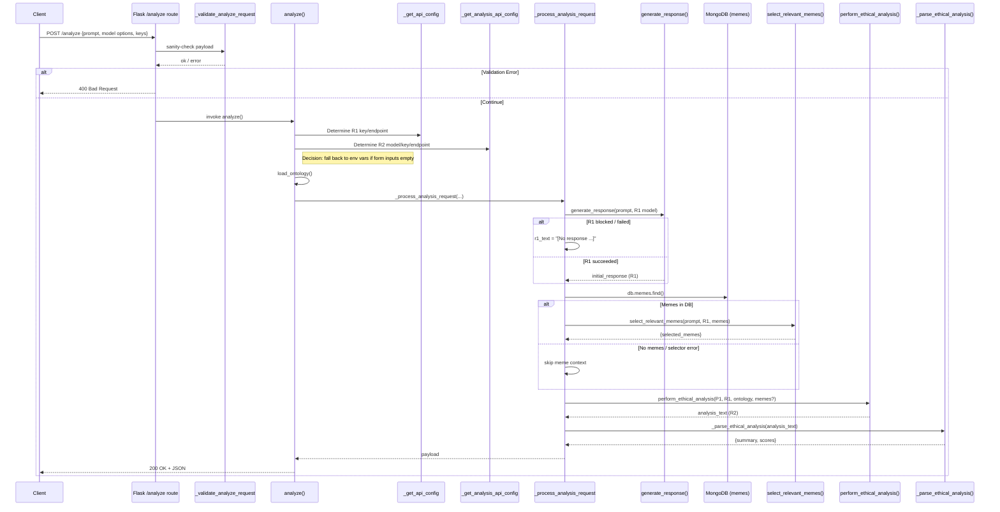

# R2 Ethical Analysis Flow – Backend Sequence Diagram

This document provides a **code‑level** view of how an `/analyze` request travels through the backend, highlighting every major decision point involved in producing the R2 (ethical analysis) output.

> NOTE:  This flow reflects the code as of $(git rev-parse --short HEAD) and should be kept up‑to‑date with future refactors.

---

---

## Detailed Decision Points

| # | Area | Decision & Fallback | Related Code |
|---|------|---------------------|--------------|
| 1 | **Validation** | Ensures `prompt` exists and optional parameters are valid; fails fast with 400 otherwise. | `api._validate_analyze_request` |
| 2 | **R1 Model Selection** | User‑provided `origin_model` if valid ➜ else environment variable `DEFAULT_LLM_MODEL` ➜ else first in `ALL_MODELS`. | `api.analyze` |
| 3 | **API Key & Endpoint (R1)** | Form values take precedence, then provider‑specific env vars (`OPENAI_API_KEY`, etc.). Missing key ➜ 400 error. | `api._get_api_config` |
| 4 | **R2 Model Selection** | User‑provided `analysis_model` if valid ➜ env `ANALYSIS_LLM_MODEL`. Must exist in `ALL_MODELS`. | `api._get_analysis_api_config` |
| 5 | **API Key & Endpoint (R2)** | Similar precedence logic as #3 but uses analysis‑specific env vars. | `api._get_analysis_api_config` |
| 6 | **R1 Generation Failure** | If R1 returns `None`/empty (blocked, quota, etc.), flow **still** continues to R2 with placeholder text. | `api._process_analysis_request` |
| 7 | **Meme Selection** | Attempt DB lookup; if no memes or selector error, continues without meme context. | `api._process_analysis_request` |
| 8 | **Prompt Template Loading** | `llm_interface._load_prompt_template` searches `backend/app/prompts`. Missing template ➜ abort R2 early. | `llm_interface.perform_ethical_analysis` |
| 9 | **R2 Parsing** | NEW logic first tries to parse entire response as JSON; if that fails, falls back to delimiter‑based parsing (`SUMMARY:` & `JSON SCORES:`). | `api._parse_ethical_analysis` |

---

## Quick Troubleshooting Checklist

1. **Prompt template missing?**  Check `backend/app/prompts/ethical_analysis_prompt.txt` exists and mounts into container.
2. **R2 returns JSON only?**  Confirm the model output starts with `{`.  Recent fix (see commit) now handles pure‑JSON responses.
3. **Delimiters present but unparsed?**  Ensure the response uses `SUMMARY:` and `JSON SCORES:` exactly (case sensitive) **or** rely on pure JSON path.
4. **Model quota / auth errors?**  Look for INFO/ERROR logs around `_call_*` helpers.
5. **Downstream parse failures?**  The API will add a warning inside `analysis_summary` if JSON parsing fails; inspect that string.

---

### Architectural Notes

* All LLM interactions are consolidated in `backend/app/modules/llm_interface.py` for easier provider swapping.
* Parse logic lives in `backend/app/api.py`; keeping it separate from LLM calls prevents circular dependencies.
* Prompt templates live in `backend/app/prompts/` and are injected via a simple `str.format` call – **no** external templating engine required.

---

**Next Steps / TODO**

* Refactor parsing & prompt building into their own service class once stable.
* Add unit tests covering both delimiter‑based and pure‑JSON R2 responses.
* Consider logging the first 1‑2k characters of raw R2 output to a rotated file for easier post‑mortem. 